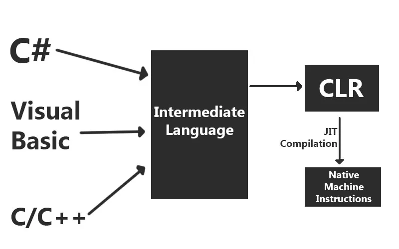
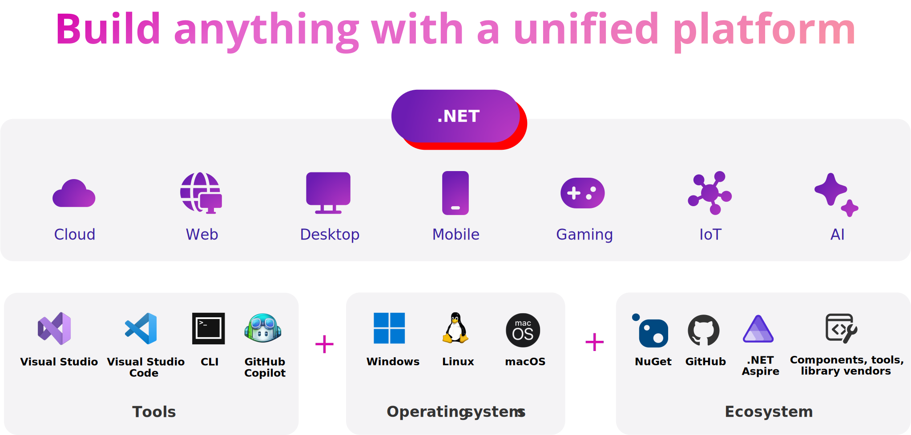

# Introducción a C#

## ¿Qué es .NET?

.NET es una plataforma de desarrollo creada por Microsoft para construir aplicaciones modernas, seguras y escalables. Incluye:

- Un entorno de ejecución (Common Language Runtime - CLR)
- Un conjunto de bibliotecas estándar (Base Class Library - BCL)
- Herramientas para desarrollar, compilar, probar y desplegar software

.NET es de código abierto, gratuito y está mantenido por Microsoft y una gran comunidad.

### ¿Qué se puede desarrollar con .NET?

- **Aplicaciones de escritorio** (Windows Forms, WPF, MAUI)
- **Aplicaciones web** (ASP.NET Core)
- **APIs REST**
- **Aplicaciones móviles** (MAUI, antes Xamarin)
- **Aplicaciones en la nube** (Azure)
- **Videojuegos** (Unity)
- **Aplicaciones de consola**
- **Servicios de backend y microservicios**

### Versiones de .NET

- **.NET Framework** (Windows-only, legado)
- **.NET Core** (multiplataforma, moderno)
- **.NET 5 en adelante** (unificación del ecosistema, versión actual: .NET 8)

### .NET Multiplataforma

Desde .NET Core, la plataforma permite desarrollar y ejecutar aplicaciones en:

- **Windows**
- **Linux**
- **macOS**

#### ¿Cómo lo logra?

- El runtime de .NET (CLR) está disponible para cada sistema operativo.
- Los compiladores generan código intermedio (IL) que se ejecuta en cualquier sistema donde esté instalado .NET.
- Los proyectos pueden contener múltiples targets de plataforma (cross-targeting).



### .NET MAUI (Multi-platform App UI)

- Es la evolución de Xamarin.
- Permite crear aplicaciones móviles y de escritorio desde un solo código base.
- Soporta Android, iOS, Windows y macOS.
- Usa C# y XAML para la interfaz de usuario.

### Herramientas para trabajar con .NET

- **Visual Studio** (Windows y macOS)
- **Visual Studio Code** (con extensiones de C#)
- **CLI de .NET (`dotnet`)**

#### Ejemplos de comandos:

```bash
dotnet new console -n MiApp
cd MiApp
dotnet run
```



[Fuente](https://devblogs.microsoft.com/dotnet/announcing-dotnet-9/)

-------

## ¿Qué es C#?

Es un lenguaje de programación moderno, orientado a objetos, desarrollado por Microsoft. Forma parte del ecosistema .NET y se utiliza para construir aplicaciones de todo tipo: escritorio, web, móviles, videojuegos, APIs y más.

### ¿Qué es un programa C#?

Es una **lista de instrucciones** que se compilan en lenguaje intermedio (IL) y se ejecutan en la máquina virtual del entorno .NET. Todo programa comienza su ejecución en el método `Main`.

```csharp
using System;

class Program
{
    static void Main()
    {
        Console.WriteLine("Hola mundo");
    }
}
```

### Expresión vs Instrucción

- **Expresión**: produce un valor.

```csharp
3 + 4
nombre + " " + apellido
```

- **Instrucción**: realiza una acción.

```csharp
int x = 5;
Console.WriteLine("Hola");
```

### Punto y coma `;`

- C# requiere el uso de `;` para finalizar cada instrucción.

```csharp
int x = 5;
Console.WriteLine(x);
```

### Espacios en blanco

C# ignora múltiples espacios y saltos de línea. Se recomienda usarlos para mejorar la legibilidad.

## Palabras clave (keywords)

| Palabra clave | Uso |
|---------------|-----|
| `int`         | Entero |
| `string`      | Texto |
| `bool`        | Booleano |
| `if`, `else`  | Condicionales |
| `for`, `while`| Bucles |
| `return`      | Devuelve valor |
| `class`       | Define una clase |
| `try`, `catch`| Manejo de errores |


### Identificadores en C#

- Son los nombres de variables, clases, métodos, etc.
- Deben comenzar con una letra o `_`.
- Sensibles a mayúsculas.

```csharp
int edad;
int Edad; // válido y diferente
```

### Notación camelCase y PascalCase

- `edadUsuario` → camelCase (variables, parámetros)
- `EdadUsuario` → PascalCase (clases, propiedades, métodos)

> En C# se prefiere camelCase para variables y PascalCase para clases y métodos.


### Variables y Tipos de Datos

#### ¿Qué es una variable?

Una **variable** es un espacio en memoria donde podemos guardar un valor.

#### Declaración y asignación

```csharp
int edad = 30;
string nombre = "Ana";
```

#### Tipos primitivos

- `int`: números enteros
- `double`: números con decimales
- `char`: un solo carácter
- `string`: texto
- `bool`: `true` o `false`

### Operaciones matemáticas

```csharp
int suma = 10 + 5;
int resta = 20 - 3;
int producto = 4 * 6;
int division = 8 / 2;
int resto = 9 % 2;
```

### Concatenación de textos

```csharp
string nombre = "Juan";
string saludo = "Hola, " + nombre;
Console.WriteLine(saludo); // Hola, Juan
```

### Mostrar información en pantalla

```csharp
Console.WriteLine("Mensaje para el usuario");
```

### Pedir información al usuario

```csharp
Console.Write("¿Cómo te llamás? ");
string nombre = Console.ReadLine();
Console.WriteLine("Hola, " + nombre);
```

### Tipos de datos

En C#, cada variable debe tener un tipo definido.

```csharp
int edad = 30;
string nombre = "Laura";
bool esMayor = true;
```

| Tipo     | Descripción                          | Bits  | Rango de valores                                              | Alias    |
|----------|--------------------------------------|-------|----------------------------------------------------------------|----------|
| SByte    | Bytes con signo                      | 8     | [-128, 127]                                                    | sbyte    |
| Byte     | Bytes sin signo                      | 8     | [0, 255]                                                       | byte     |
| Int16    | Enteros cortos con signo             | 16    | [-32.768, 32.767]                                              | short    |
| UInt16   | Enteros cortos sin signo             | 16    | [0, 65.535]                                                    | ushort   |
| Int32    | Enteros normales                     | 32    | [-2.147.483.648, 2.147.483.647]                                | int      |
| UInt32   | Enteros normales sin signo           | 32    | [0, 4.294.967.295]                                             | uint     |
| Int64    | Enteros largos                       | 64    | [-9.223.372.036.854.775.808, 9.223.372.036.854.775.807]        | long     |
| UInt64   | Enteros largos sin signo             | 64    | [0, 18.446.744.073.709.551.615]                                | ulong    |
| Single   | Reales con 7 dígitos de precisión    | 32    | [1.5×10⁻⁴⁵, 3.4×10³⁸]                                          | float    |
| Double   | Reales de 15-16 dígitos de precisión | 64    | [5.0×10⁻³²⁴, 1.7×10³⁰⁸]                                       | double   |
| Decimal  | Reales de 28-29 dígitos de precisión | 128   | [1.0×10⁻²⁸, 7.9×10²⁸]                                         | decimal  |
| Boolean  | Valores lógicos                      | 32    | `true`, `false`                                                | bool     |
| Char     | Caracteres Unicode                   | 16    | ['\\u0000', '\\uFFFF']                                         | char     |
| String   | Cadenas de caracteres                | Var.  | Limitado por la memoria                                        | string   |
| Object   | Cualquier objeto                     | Var.  | Cualquier objeto                                               | object   |

### Palabras reservadas

| abstract | as     | base   | bool    | break     |
|----------|--------|--------|---------|-----------|
| byte     | case   | catch  | char    | checked   |
| class    | const  | continue | decimal | default |
| do       | double | else   | enum    | event     |
| explicit | extern | false  | finally | fixed     |
| float    | for    | foreach| goto    | if        |
| implicit | in     | value  | int     | interface |
| internal | long   | new    | null    | out       |
| override | params | private| protected | public  |
| readonly | ref    | return | sbyte   | sealed    |
| short    | sizeof | stackalloc | static | string |
| struct   | switch | this   | throw   | true      |
| try      | typeof | uint   | ulong   | unchecked |
| unsafe   | ushort | using  | virtual | void      |
| volatile | while  |        |         |           |


### Tipado Estático y Fuerte

C# es un lenguaje de tipado **estático** y **fuerte**.

- Estático: los tipos se definen en tiempo de compilación.
- Fuerte: no se permite mezclar tipos sin conversión explícita.
